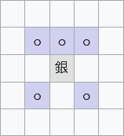

# Chess-any

Chess-any 是一个计划支援任何象棋类游戏的前端框架，采用 NodeJS+Vite 开发。

## 棋子移动规则表示法

为了支援任何象棋类游戏，有必要提供一种能够描述所有这些游戏里的棋子的移动规则的表示法，以便框架去判断以及枚举合法步着。

>	注意，此节所述并非*步着*表示法。
	后者指的是一盘棋局中下出的实际走子，如「马从 b1 走到 c3」；
	前者指的是一种游戏里的某种棋子的移动方式，如「国际象棋里，马可以先朝一个方向移动两格，再朝另一个方向移动一格，走到空位置或吃掉该位置的敌方棋子」。

我将这种记法称为 Chess-any Rule Notation (CARN, /karn/)，以后在本文里指代均用 CARN。

### 语法模式

CARN 的合法语句是由单字（[token](
	https://en.wikipedia.org/wiki/Lexical_analysis#Token
)）组成的，单字即不可再分割的最小语义单位。

单字和单字之间须由至少一个空白字符分隔，除非后面紧跟着的是保留符号。
CARN 的保留符号有：`,` `;` `@` `+` `-` `~` `#` `$` `(` `)` `|`。

此外，反斜杠（`\`）禁止出现于 CARN 中，这主要是出于后续可能修订对转义的支持。

CARN 的语法将用扩展 Backus–Naur 范式（[EBNF](
	https://en.wikipedia.org/wiki/Extended_Backus%E2%80%93Naur_form
)）予以形式化描述。

### 单轴步着

对于一个类象棋的棋盘，我们可以把盘面分成若干***轴向***，在每个轴向上都有*离散*的棋盘格划分。
一般的矩形棋盘可以简单地划分成横行（rank）与纵列（file）两个轴向。

最基本的步着形式是「沿某轴向走几格」。
可以简单地把轴向和格数并排记录：
这里，格数通常是一个简单的整数，但有时棋子的移动有*方向*上的区别，可以通过在格数前面添加 `+` 或 `-` 来限定移动的方向（前提是对应的轴向天然有方向的概念，如横行就没有方向）。

例如，中国象棋里的兵就只能沿纵列往前走一格（当然这并不准确，后面会修正），可以记为：`Rank +1`。

如果棋子在轴向上的移动距离不止一个固定的格数，则可以指定一个或多个范围。
范围的始末格数由 `~` 分隔（闭区间），前后无空白符。
如果范围没有限制，则可以用 `*` 来表示任意格数。
多个范围的效果相当于它们的并集。
同样，可以通过前缀符号来限定移动方向。

如 `File 1~2` 表示可以沿横行任意方向移动至多两格（不能不动），而 `File *` 表示可以在同一横行里任意移动（可以不动）。

### 多轴步着

更多情况下，棋子的移动规则并非局限在单一轴向上，而是多轴向的混合。
我们将若干单轴步着并在一起，用 `,` 分隔以表示这种步着。

例如，国际象棋里的王可以沿横行移动至多一格，再沿纵列移动至多一格（顺序无关紧要），可以记为 `File ~1 Rank ~1`（这同样并不准确，后面也会修正，以后碰到相同情况不再标出）。

有时我们需要在所有轴向上移动相同格数的行为，可以用 `**` 来表示所有轴。
这样，国际象棋里的王的移动规则可以简化为 `*# 1 ** ~1`（至少在某一轴向上移动一格）。

又有时我们虽然并不关心移动的轴向具体是什么，但是棋子在不同轴向上有不同的移动距离（如走日字的马）。
可以用任意多个 `*#` 来指代这些匿名轴向。

中国象棋马的移动规则可以记为 `*# 2 *# 1`，而象则是 `*# 2 *# 2`。

现在考虑该如何描述国际象棋里的象这种可以在多于一个轴向上移动任意多步的棋子。
一个直观的想法是 `*# * *# *`，但很可惜，这个记法表示的是「在两个不同轴向上分别移动任意多格」，而我们需要的是「在两个不同轴向上移动相同多格」。
因此，必须提供一种在不同单轴约束间建立关联的方法。
CARN 的解决方案是引入命名的变量。

若欲使用命名变量，请将单轴步着的格数替换为含有以 `$` 引起的变量名的数学表达式，其间不能包含空格。
这样，国际象棋的象可以表示为 `*# $n *# $n`。

如果要表达*任意多个*轴向（而非 `**` 表达的*全体未指涉*轴向），可以使用 `**#`。
如国际象棋的后：`**# $n`。

最后，任何未涉及到的轴向的移动距离默认为 0（即不可在那些轴向上移动）。

### 复合步着

在更复杂的例子里，棋子的移动规则甚至不能用单独的多轴步着来描述（如将棋里的*银将*）。
我们可以将若干多轴步着*逻辑或*到一起，以 `|` 分隔，组合成复合步着。

以银将为例，其移动规则为：移动到前面一行相邻的三个格，或后面一行相邻但不同列的两个格。
这可以记为 `Rank +1 File ~1 | Rank -1 File 1`。



### 自定义步着判定

实际上的游戏总比上面说的更加复杂，总有一些仅用步着没法说清楚的概念。
比如，大多数象棋要求落子的位置要么是空格（视作移动），要么是对方的棋子（视作吃子），而不能是己方棋子；
再比如，中国象棋里的炮要求跨过一个棋子才能吃子。
为了描述这些特殊概念，我们必须引入一些步着之外的记号。

CARN 的解决方案是：调用外部函数。

作为使用者，你可以不需要了解如何编写这些函数，而只需要掌握调用它们的语法即可（需要的话，可以参考具体的实现的技术文档）。

要调用外部函数，只消在单轴步着中使用 `@函数名(参数,...)` 的语法即可。
对于无参函数，参数列表的空括号是可选的。

CARN 的实现内置了一些常用函数，如：
- `@Empty`：目标格没有棋子。
- `@NoOpponent`：目标格没有非己方棋子。
- `@NoAlly`：目标格没有己方棋子。
- `@JumpOver(n)`：移动路径跳过 `n` 个棋子。

现在，我们可以给所有种类的棋子的移动规则加上 `@NoAlly` 了。
中国象棋的炮的吃子规则则是 `*# * @JumpOver(1)`（注意到并不需要显式地写出至少移动一格，这可以由 `@JumpOver(1)` 来保证）。

### 多步着模式的解决方案

在象棋及其变种里，几乎所有棋子都有至少两种步着模式：单纯的移动，以及吃子。
尽管大多数棋子的两种步着模式的规则完全相同，但仍有一些棋子是不同的。
作为开发者，你应该为每种棋子的所有步着模式设置单独的访问点（entry/accessor），尽管它们可能指向同一个 CARN 语句。

另外，在区分移动和吃子的规则时，`@NoAlly` 往往需要替换成 `@NoOpponent` 或 `@Empty`。
这可以交给下游工序自动化处理。

例如，国际象棋里的兵和王的建模可能如下：

```yaml
pawn:
  move_patterns:
    move: @NoAlly Rank 1 | @PawnStartingPosition @NoAlly Rank 2
    capture: @Opponent Rank +1 File 1
king:
  move_patterns:
    move: @NoAlly @NotAttacked ** 1 | @CanLongCastle File -3 | @CanShortCastle File +2
    capture: @Opponent @NotAttacked ** 1
  hooks:
    aftermove:
      - UpdateRookIfCastled
```
